<div align="center">

[](https://lovable.dev/projects/61a791b0-575c-4aa8-a07d-68a25b250a5b)
[](https://reactjs.org)
[](https://www.typescriptlang.org/)
[](https://vitejs.dev)

AI-Powered Drug Discovery and Molecular Optimization Platform

[Getting Started](#-getting-started) •
[Core Functioning](#-core-functioning) •
[Frontend Deep-Dive](#-frontend-deep-dive-src) •
[Chemical Analysis](#-chemical-analysis--formulas)

</div>

# 🧪 Arq Molecular Engineering

Welcome to the Arq Molecular Engineering platform, an advanced AI-powered system for intelligent molecular design and optimization. This application leverages a multi-agent backend (using CrewAI and LangGraph) to perform complex medicinal chemistry tasks, all controlled and monitored through a reactive, real-time frontend built in React and TypeScript.

## 🚀 Core Functioning

The application operates on a client-server model designed for real-time, stateful interaction. The user's workflow is as follows:

```mermaid
graph TD
    subgraph Frontend
        A[⌨️ 1. User Input @ ControlPanel] --> B[📤 2. Run Crew @ Index.tsx];
        B -- "POST /api/run-crew" --> C[🚀 FastAPI Backend];
        C -- "SSE Stream" --> D[📡 5. Real-time Monitoring @ LabMonitor];
        D -- "Renders" --> I[✅ 8. Final Report];
    end

    subgraph Backend
        C -- "Starts" --> E[🤖 4. Agentic Workflow <br/> _Design ➔ Validate ➔ Route ➔ Synthesize_];
        E -- "Streams Thoughts & Report" --> C;
        K[🖼️ RDKit Image API]
    end

    subgraph Frontend Visualization
        D -- "Contains SMILES" --> J[🧬 7. MoleculeVisualization];
        I -- "Contains SMILES" --> J;
        J -- "GET /api/visualize" --> K;
        K -- "PNG Image" --> J;
    end
```



1.  ⌨️ **Input (Frontend):** The user provides a starting molecule (as a **SMILES** string), a desired **optimization goal** (e.g., "Decrease LogP"), and a set of **guardrails** or constraints (e.g., minimum similarity, molecular weight range) via the `ControlPanel` component.

2.  📤 **Request (Frontend -> Backend):** Clicking "Run Research Crew" in `Index.tsx` triggers the `handleRunCrew` function. This function packages the user's inputs into a JSON payload and sends it to the `/api/run-crew` endpoint on the FastAPI server.

3.  🔌 **SSE Connection (Backend -> Frontend):** The frontend makes this request expecting a `text/event-stream` response. The backend, upon receiving the request, initializes an agentic workflow using LangGraph and begins streaming updates back to the client as **Server-Sent Events (SSE)**.

4.  🤖 **Agentic Workflow (Backend):** The backend (`graph.py`) executes a state machine powered by a crew of specialized AI agents:
    * 🎨 **Design Agent** (`designer_agent`): Proposes a new, creative molecule based on the goal and conversation history.
    * 🔬 **Validation Agent** (`validator_agent`): Uses RDKit tools (`tools.py`) to meticulously calculate the chemical and physical properties of the new molecule.
    * 🚦 **Router Function** (`should_continue`): Acts as a gatekeeper. It checks if the new molecule meets all user constraints (similarity, MW, etc.) and the specific optimization goal.
    * 🔄 **Loop or End:** If the molecule fails validation or doesn't meet the goal, the graph loops back to the **Design Agent** with new instructions. If it succeeds (or max retries are hit), it proceeds to the final step.
    * 📊 **Synthesizer Agent** (`synthesizer_agent`): Compiles the final successful (or failed) molecule, validation data, and history into a structured final report.

```mermaid
flowchart TD
A["Start"] --> B["🎨 Design Agent <br> designer_agent"]
B -- Proposes New Molecule --> C["🔬 Validation Agent <br> validator_agent"]
C -- Sends Validation Results --> D{"🚦 Router Function <br> should_continue"}
D -- Validation Failed / Goal Not Met 🔄 --> B
D -- Validation Succeeded / Max Retries --> E["📊 Synthesizer Agent <br> synthesizer_agent"]
E -- Compiles Final Report --> F["End"]
```

  


5.  📡 **Real-Time Monitoring (Frontend):** As the backend agents work, they stream `agent_thought` events. The frontend's `handleRunCrew` function reads these events from the stream, parses the JSON, and updates the `messages` state array.

6.  🖥️ **Live UI Updates (Frontend):** The `LabMonitor` component, which receives the `messages` array, automatically re-renders. It maps over the `messages` and displays each new thought using the `AgentMessage` component, creating a live log of the agents' "conversation".

7.  🧬 **Visualization (Frontend):** When an `AgentMessage` (or `FinalReport`) needs to display a molecule, it uses the `MoleculeVisualization` component. This component dynamically calls the backend's `/api/visualize?smiles=...` endpoint, which returns a PNG image of the molecule generated by RDKit.

8.  ✅ **Final Report (Frontend):** When the backend stream sends a `final_report` event, the `Index.tsx` page adds this special message to the `messages` array. The `LabMonitor` detects this message and renders the `FinalReport` component, showing the final proposed molecule and a summary of the entire run.

---

## ✨ Frontend Deep-Dive (`src/`)

The frontend is the heart of the user experience, designed to turn a complex, asynchronous backend process into a simple, observable, and interactive "lab session."

### Key Components

* **`Index.tsx` (Main Page):**
    * **State Management:** Holds the two most critical pieces of UI state: `isRunning` (a boolean) and `messages` (an array of `StreamMessage` objects).
    * **API Communication (`handleRunCrew`):** This function is the primary communication handler.
        1.  **POST Request:** It uses `fetch` to send the `ResearchParams` to the `/api/run-crew` endpoint.
        2.  **Stream Reading:** It gets the `response.body` (a `ReadableStream`) and pipes it through a `TextDecoderStream` to handle text encoding.
        3.  **SSE Parsing:** It runs a `while(true)` loop to read chunks from the stream. It buffers incoming text and splits it by `\n\n` (the SSE message delimiter).
        4.  **Event Handling:** For each message, it parses the `data: ` JSON payload and checks its `type` (e.g., `agent_thought`, `final_report`), then updates the `messages` state, causing the UI to re-render.

* **`ControlPanel.tsx`:**
    * A stateful form component that uses `useState` to manage the user's inputs for SMILES, goal, and constraints (similarity, MW).
    * It's a "dumb" component in that it only collects data and uses the `onRunCrew` prop (passed down from `Index.tsx`) to send the data "up" to the parent page when the user clicks the "Run" button.

* **`LabMonitor.tsx`:**
    * Receives the `messages` array and `isRunning` boolean as props.
    * Renders a placeholder if `messages` is empty.
    * Maps over the `messages` array and renders the correct component for each message type (`AgentMessage` or `FinalReport`).
    * Uses a `ScrollArea` and a `useRef` (`messagesEndRef`) to automatically scroll to the bottom as new messages are added, creating the "live log" effect.

* **`AgentMessage.tsx`:**
    * A display component that receives a single `thought` object.
    * It selects a color and icon based on the `thought.agent` (e.g., `Designer`, `Validator`, `Router`).
    * If `thought.validation_data` exists, it formats and renders a key-value grid of the chemical properties.
    * If `thought.proposed_smiles` exists, it renders the `MoleculeVisualization` component.

* **`MoleculeVisualization.tsx`:**
    * Receives a `smiles` string as a prop.
    * Uses `useEffect` to `fetch` the molecule's image from `/api/visualize?smiles=...`.
    * Handles loading and error states internally.
    * It converts the fetched image `blob` into a `URL.createObjectURL()` and displays it in an `` tag.

---

## 🧬 Backend Architecture (`*.py`)

The backend is a Python **FastAPI** server that orchestrates an AI agent crew using **CrewAI** and **LangGraph**.

* **`main.py` (API Server):**
    * `/api/visualize` [GET]: Takes a `smiles` query parameter, uses RDKit to generate a molecule image, and returns it as `image/png`.
    * `/api/run-crew` [POST]: The main workflow endpoint.
        * It accepts the user's `CrewRequest` (smiles, goal, constraints).
        * It initializes a `ResearchState` for LangGraph.
        * It returns a `StreamingResponse` that calls an async generator (`event_stream`).
        * This generator `astream`s the LangGraph, yielding JSON-formatted SSE messages for `agent_thought`, `final_report`, etc., as the graph runs.

* **`graph.py` (Agentic State Machine):**
    * Defines the `ResearchState` (the "memory" of the workflow).
    * Defines the CrewAI agents: `designer_agent`, `validator_agent`, and `synthesizer_agent`.
    * **`should_continue` (The Router):** This is the most critical logic. After the `validate` node runs, this function checks the `ResearchState`:
        1.  Checks for **hard stops** (max retries, invalid SMILES, constraint violations like similarity or MW).
        2.  Checks for **goal fulfillment** (e.g., is the new LogP *actually* lower?).
        3.  If all constraints and goals are met, it routes to `synthesize` for a success report.

* **`tools.py` (Cheminformatics Tools):**
    * A collection of RDKit functions wrapped with CrewAI's `@tool` decorator.
    * These tools perform the core chemical calculations, such as `get_logp`, `get_similarity`, and `get_lipinski_violations`.

---

## 🔬 Chemical Analysis & Formulas

The `validator_agent` and `should_continue` router rely on several key cheminformatics principles provided by RDKit.

### 1. Crippen LogP (AlogP)

This is a method for calculating the octanol-water partition coefficient (LogP), which measures a molecule's hydrophobicity. It's an atomic-contribution method, meaning it sums up the contributions of individual atoms and fragments.

**Conceptual Formula:**
```math
LogP = \sum_{i} a_i n_i
```

Where:
* $`a_i`$ is the contribution of a specific atom type (e.g., "carbon in a benzene ring").
* $`n_i`$ is the number of atoms of that type in the molecule.

### 2. Tanimoto Similarity

This is a common metric for comparing molecular structures. It works by converting both molecules into binary "fingerprints" (long vectors of 1s and 0s representing structural features). The Tanimoto coefficient measures the similarity between these two fingerprints.

**Formula:**
```math 
T(A, B) = N_c / (N_a + N_b - N_c)
```

Where:
* $`A`$ and $`B`$ are the fingerprints for molecule A and molecule B.
* $`N_a`$ is the number of bits set to `1` in fingerprint $`A`$.
* $`N_b`$ is the number of bits set to `1` in fingerprint $`B`$.
* $`N_c`$ is the number of bits set to `1` in *both* $`A`$ and $`B`$ (the intersection).

A value of `1.0` means the molecules are identical, while `0.0` means they share no common features.

### 3. Lipinski's Rule of 5

This is a set of "guardrails" used in drug discovery to predict if a molecule is likely to be orally bioavailable. The `get_lipinski_violations` tool counts how many of these rules are broken.

**The Rules:**
A molecule is *unlikely* to be orally bioavailable if it violates **two or more** of the following:
* **Molecular Weight (MW)**: > 500 Daltons
* **LogP**: > 5
* **H-Bond Donors (HBD)**: > 5 (Sum of -OH and -NH groups)
* **H-Bond Acceptors (HBA)**: > 10 (Sum of N and O atoms)

---

## 🛠️ Tech Stack

### 🖥️ Frontend (The Lab Interface)
* ⚛️ **React 18 (with TypeScript):** The core UI library for building a reactive and type-safe user interface.
* ⚡ **Vite:** Next-generation build tool providing a blazing fast development experience.
* 🎨 **shadcn/ui:** A beautifully designed component library, providing the building blocks for our UI.
* 🖌️ **Tailwind CSS:** A utility-first CSS framework for rapid and custom styling.
* 🔄 **React Query:** Manages server state, caching, and real-time data fetching from our backend.
* 💡 **Lucide React:** A clean and consistent icon set used throughout the application.
* 🔔 **Sonner:** Provides non-intrusive toast notifications for user feedback.

### 🔬 Backend (The Agentic Crew)
* 🐍 **Python 3.10+:** The foundation for all backend logic and scientific computing.
* 🚀 **FastAPI:** A high-performance web framework used to build our API and stream real-time SSE data.
* 🤖 **CrewAI:** The primary framework for creating and orchestrating our specialized AI agents.
* ⛓️ **LangGraph:** The engine that manages the stateful, cyclical workflow, allowing agents to loop and collaborate.
* 🧬 **RDKit:** The core cheminformatics library used to perform all molecular calculations, comparisons, and visualizations.
* 🧠 **Gemini (via LiteLLM):** The advanced large language model that provides the reasoning power for our AI agents.
* 🔌 **Uvicorn:** The high-speed ASGI server that runs our FastAPI application.
---

## 📦 Getting Started

### Prerequisites
* Node.js 18+
* Python 3.10+
* A `GOOGLE_API_KEY` (or other LLM provider key) set in your environment.

### 1. Backend Setup

```bash
# 1. Clone the repository
git clone [https://github.com/emiliovenegas/hacknation-falcon270.git](https://github.com/emiliovenegas/hacknation-falcon270.git)
cd hacknation-falcon270

# 2. Create a virtual environment
python -m venv venv
source venv/bin/activate  # (Linux/macOS)
.\venv\Scripts\activate   # (Windows)

# 3. Install Python dependencies
pip install -r requirements.txt

# 4. Create your .env file
# (This will be an empty file, add your key)
touch .env

# 5. Add your API key to the .env file
# The graph.py file is configured to look for GOOGLE_API_KEY
echo 'GOOGLE_API_KEY="your_api_key_here"' > .env

# 6. Run the backend server (on port 8000)
uvicorn main:app --reload
```
### 2. Frontend Setup
```bash
# 1. In a new terminal, navigate to the project root
cd hacknation-falcon270

# 2. Install Node.js dependencies
npm install

# 3. Run the frontend development server (on port 8080)
npm run dev
```
You can now access the application at `http://localhost:8080`. The frontend will automatically proxy API requests from `/api` to the backend server running on `http://localhost:8000` (as configured in `vite.config.ts`).

